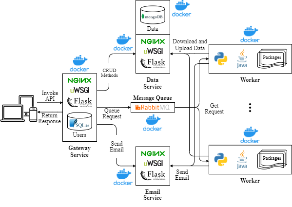

# MAESTRO back-end
This repo contains the on-prem implementation of [MAESTRO](https://vascocandeias.github.io/maestro), a website for multivariate time series analysis using dynamic Bayesian networks. 

